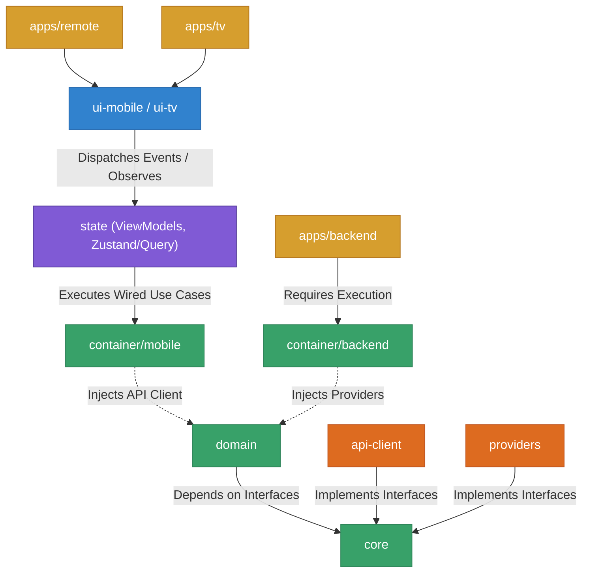

# Horus Final Production Architecture

This document represents the finalized, highly scalable Clean Architecture for the Horus monorepo. It specifically integrates strict environment separation, declarative UI states, queue-based scraping, and exception-less logic boundaries for true production readiness.

---

## 1. Top-Level Folder Structure & Containerization

```text
horus/
├── apps/
│   ├── remote/              # Mobile client (Expo)
│   ├── tv/                  # TV client (React Native TVOS, isolated logic)
│   └── backend/             # Node/Bun server orchestrating the actual data fetching
│
├── packages/
│   ├── core/                # Entities, value-objects, interfaces
│   ├── domain/              # Business logic & use-cases
│   ├── providers/           # Web scrapers, external source integrations
│   ├── api-client/          # Shared HTTP client for Apps to reach the backend
│   │
│   ├── container/           # Environment-specific DI wiring:
│   │   ├── mobile/          # Wires domain with api-client for apps
│   │   ├── backend/         # Wires domain with providers for the server
│   │   └── test/            # Wires domain with mock repositories for Jest
│   │
│   ├── state/               # ViewModels / State Managers (Zustand, Redux, or TanStack)
│   ├── ui-core/             # Shared agnostic React primitives
│   ├── ui-mobile/           # Mobile-specific UI (Expo router, touch)
│   └── ui-tv/               # TV-specific UI (D-pad focus engine)
│   │
│   ├── config-eslint/
│   └── config-typescript/
```

---

## 2. The Result Pattern & Domain Outputs

To ensure rock-solid stability, exceptions/`throw` statements must not be used to control flow across package boundaries. 

The `domain` layer strictly outputs via the **Result Pattern** (or structured Data Transfer Objects). 

```typescript
// Example mental model of a Use Case output
export type Result<T, E = Error> = 
  | { ok: true; value: T }
  | { ok: false; error: E };

// The Domain never throws; it returns structured failures:
const result = await getLatestEpisodesUseCase.execute();
if (!result.ok) {
   // State layer cleanly handles the specific error type
   return state.setError(result.error.code);
}
```

---

## 3. Total System Dependency Flow

This architecture introduces the **State/ViewModel Layer** between the UI and Domain. The UI remains 100% declarative, simply observing values, while the State layer coordinates UI events with the Domain.



---

## 4. Backend Routing & Scalability

The `apps/backend` requires specific structuring to handle the unpredictability of web scraping without blocking critical request logs.

### **Routing Flow**
The internal architecture of the Backend application must flow strictly as:
`Routes` → `Controllers` (Input validation/HTTP context) → `Domain` (Via `container/backend`).

1. **Routes Layer**: Exclusively maps URLs and HTTP verbs to specific controllers.
2. **Controllers Layer**: Extracts query params/body, passes them to the Domain Use Case provided by the Container, and maps the `Result` output to proper HTTP Status Codes (e.g., 200 OK, 404 Not Found, 400 Bad Request).
3. **Domain Layer**: Executes the business rules.

### **Async Jobs & Queue-based Scraping**
Because scraping providers is incredibly slow and prone to hanging, the backend must not hold HTTP requests open while a provider scrapes AnimeSama.

- **Queue Engine**: Use `BullMQ`, `Redis Queues`, or similar tooling.
- **Workflow**:
  1. Mobile app requests `/api/v1/episodes/refresh`.
  2. The controller adds a "ScrapeJob" to the Queue and immediately returns `202 Accepted` to the client.
  3. A background worker picks up the job from the queue, executes the `domain` logic (which calls the injected `providers`), caches the result, and stores it in the database/Redis.
  4. The client app uses polling, WebSockets, or Server-Sent Events (via its `api-client` and `state` layer) to receive the result whenever the Queue is finished.

This async decoupling guarantees the backend never runs out of execution threads holding onto pending scraped data, maximizing scalability.
