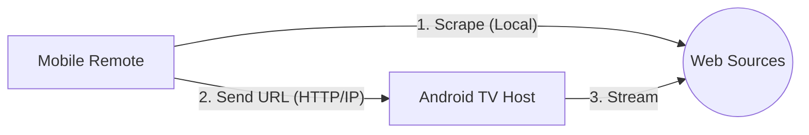

# 🎬 Horus Ecosystem

> Le successeur spirituel de `movie-cli`, porté sur grand écran. Une solution de streaming auto-hébergée (sans serveur tiers) pour Android TV, pilotée par votre smartphone.

---

## 📌 Concept

Ce projet est un écosystème complet en **React Native** permettant de transformer une Android TV en hub de streaming ultime (Anime, Films, Séries) en utilisant la puissance du scraping local. 

**Zéro serveur.** Tout se passe sur votre réseau local.

## 📱 Composants

### 1. TV Host (`/apps/android-tv`)
* **Interface "10-foot" :** Optimisée pour une navigation à 3 mètres de distance.
* **Focus Engine :** Navigation fluide via D-Pad (télécommande).
* **HTTP Bridge :** L'application TV agit comme un serveur local pour recevoir les commandes du téléphone.
* **Powerful Player :** Support natif du HLS (.m3u8) et MP4 via ExoPlayer.

### 2. Mobile Remote (`/apps/mobile-remote`)
* **Scraper Engine :** Embarque la logique de `movie-cli`, `ani-cli` et `animesama-cli` en JavaScript.
* **Auto-Discovery :** Détecte automatiquement la TV sur le réseau Wi-Fi via ZeroConf.
* **Control Center :** Recherche de contenu, gestion des favoris et contrôle de la lecture (Play/Pause/Seek).

## 🛠 Stack Technique

| Technologie | Utilisation |
| :--- | :--- |
| **React Native TVOS** | Framework principal pour Android TV & Mobile |
| **Axios + Cheerio** | Moteur de scraping (Portage de la logique Python/Bash) (! Axios est compromis sur les versions 0.30.4 & 1.14.1) |
| **ZeroConf / mDNS** | Découverte automatique des appareils sur le réseau |
| **HTTP Bridge** | Communication RPC entre le téléphone et la TV |
| **React Native Video** | Lecteur vidéo haute performance |

## 🏗 Architecture "Standalone"



1.  **Recherche :** Vous cherchez un média sur l'application mobile (le téléphone fait le travail de scraping).
2.  **Liaison :** Le téléphone envoie l'URL finale et les métadonnées à l'IP de la TV.
3.  **Lecture :** L'app TV intercepte la commande et lance le player instantanément.

## 🚀 Installation (Dev Mode)

### Pré-requis
* Node.js (v18+)
* Android Studio & SDK Android
* Un appareil Android TV ou un Chromecast Google TV

### Setup
1. **Cloner le projet :**
   ```bash
   git clone [https://github.com/CoRExE/Horus.git](https://github.com/CoRExE/Horus.git)
   cd Horus
   ```
2. **Installer les dépendances :**
   ```bash
   npm install
   ```
3. **Lancer l'app TV :**
   ```bash
   npx react-native run-android --project-path apps/android-tv
   ```
4. **Lancer l'app Mobile :**
   ```bash
   npx react-native run-android --project-path apps/mobile-remote
   ```

## ⚖️ Disclaimer

Ce projet est une preuve de concept à but éducatif. Il ne contient aucun média et n'héberge aucun contenu. L'utilisateur est responsable de l'usage qu'il fait des moteurs de scraping intégrés et doit respecter les droits d'auteur en vigueur dans sa juridiction.

---

Projet inspiré par les excellents `ani-cli`, `animesama-cli` et `movie-cli`.
