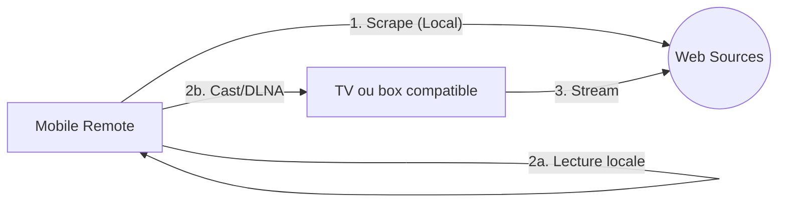

# 🎬 Horus Ecosystem

> Un prototype React Native de recherche et de lecture locale, avec contrôle Chromecast/DLNA depuis un smartphone.

---

## 📌 Concept

Ce dépôt est un monorepo **React Native** en cours de développement. L'application mobile effectue les recherches localement et peut lire un flux sur le téléphone ou l'envoyer vers un appareil Chromecast/DLNA.

**Zéro serveur.** Tout se passe sur votre réseau local.

## 📱 Composants

### Mobile Remote (`/apps/HorusRemote`)
* **Scraper Engine :** Embarque la logique de `movie-cli`, `ani-cli` et `animesama-cli` en JavaScript.
* **Discovery :** Détecte les appareils DLNA via SSDP et les appareils Google Cast.
* **Lecture :** Lecture locale via Expo Video ou envoi vers Chromecast/DLNA.
* **Données locales :** Wishlist et historique persistés avec Zustand/AsyncStorage.

## 🛠 Stack Technique

| Technologie | Utilisation |
| :--- | :--- |
| **Expo / React Native** | Application mobile Android, iOS et Web |
| **Axios + Cheerio** | Moteur de scraping |
| **SSDP / UPnP / Google Cast** | Découverte et contrôle des appareils |
| **Expo Video** | Lecteur vidéo mobile |

## 🏗 Architecture "Standalone"



1.  **Recherche :** Vous cherchez un média sur l'application mobile (le téléphone fait le travail de scraping).
2.  **Lecture :** Le téléphone lit le flux ou l'envoie à un appareil Cast/DLNA.
3.  **Proxy ponctuel :** Le téléphone expose un proxy local authentifié lorsqu'un flux exige des en-têtes HTTP spécifiques.

## 🚀 Installation (Dev Mode)

### Pré-requis
* Node.js (v18+)
* Android Studio & SDK Android
* Un appareil Chromecast ou DLNA pour tester la diffusion distante

### Setup
1. **Cloner le projet :**
   ```bash
   git clone [https://github.com/CoRExE/Horus.git](https://github.com/CoRExE/Horus.git)
   cd Horus
   ```
2. **Installer les dépendances :**
   ```bash
   pnpm install
   ```
3. **Lancer l'app mobile :**
   ```bash
   pnpm --dir apps/HorusRemote start
   ```
4. **Vérifier le code :**
   ```bash
   pnpm check
   ```
## ⚖️ Disclaimer

Ce projet est une preuve de concept à but éducatif. Il ne contient aucun média et n'héberge aucun contenu. L'utilisateur est responsable de l'usage qu'il fait des moteurs de scraping intégrés et doit respecter les droits d'auteur en vigueur dans sa juridiction.

---

Projet inspiré par les excellents `ani-cli`, `animesama-cli` et `movie-cli`.
