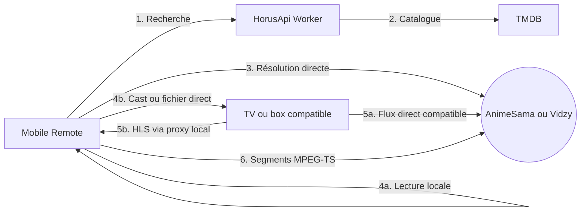

# 🎬 Horus Ecosystem

> Un prototype React Native de recherche et de lecture locale, avec contrôle Chromecast/DLNA depuis un smartphone.

---

## 📌 Concept

Ce dépôt est un monorepo **React Native** en cours de développement. L'application mobile peut lire un flux sur le téléphone ou l'envoyer vers un appareil Chromecast/DLNA. Un petit Worker Cloudflare protège le jeton TMDB utilisé par la recherche de films et de séries ; la résolution des flux reste effectuée sur le téléphone.

## 📱 Composants

### Mobile Remote (`/apps/HorusRemote`)
* **Sources :** AnimeSama pour les animés, catalogue TMDB et résolution directe Vidzy pour les films et séries.
* **Discovery :** Détecte les appareils DLNA via SSDP et les appareils Google Cast.
* **Lecture :** Lecture locale via Expo Video ou envoi vers Chromecast/DLNA.
* **Passerelle HLS/DLNA :** Transforme les playlists HLS MPEG-TS en flux continu pour les téléviseurs qui ne lisent pas directement les fichiers `.m3u8`.
* **Télécommande :** Synchronise lecture, pause, progression et volume avec le renderer, et permet de naviguer entre les épisodes.
* **Données locales :** Wishlist et historique persistés avec Zustand/AsyncStorage.

### API catalogue (`/apps/HorusApi`)
* **Secret TMDB :** conserve le jeton TMDB hors du bundle mobile.
* **Catalogue :** expose une recherche films/séries normalisée et mise en cache.
* **Hébergement :** Cloudflare Workers ; aucun média ni lien de lecture ne transite par ce service.

## 🛠 Stack Technique

| Technologie | Utilisation |
| :--- | :--- |
| **Expo / React Native** | Application mobile Android, iOS et Web |
| **Axios + Cheerio** | Moteur de scraping |
| **SSDP / UPnP / Google Cast** | Découverte et contrôle des appareils |
| **Expo Video** | Lecteur vidéo mobile |
| **Cloudflare Workers / TMDB** | Catalogue de films et séries sans exposer le jeton TMDB |

## 🏗 Architecture



1.  **Recherche :** le Worker interroge TMDB sans divulguer son jeton au client mobile. La recherche AnimeSama reste directe.
2.  **Résolution :** le téléphone récupère et analyse la page Vidzy comme du texte pour en extraire le manifeste HLS ; aucun lecteur web ni script publicitaire n'est exécuté.
3.  **Lecture :** le téléphone lit le flux ou l'envoie à un appareil Cast/DLNA.
4.  **Passerelle locale :** le téléphone expose un proxy authentifié lorsqu'un flux exige des en-têtes HTTP spécifiques ou lorsqu'un manifeste HLS doit être présenté au renderer DLNA comme un flux MPEG-TS continu.

La passerelle prend en charge les playlists HLS MPEG-TS, y compris les playlists
maîtres, glissantes, relatives ou signées. Elle actualise le manifeste pendant la
lecture, retente les segments en erreur et essaie un autre serveur si le renderer
DLNA ne démarre pas. Les variantes HLS chiffrées et les segments fMP4
nécessiteraient un véritable remuxage/transcodage et sont rejetés explicitement.

La VF est prioritaire et une indisponibilité de cette piste impose un nouveau choix
au lieu de basculer silencieusement vers la VO. Avec la passerelle MPEG-TS, les
sous-titres séparés d'une source VOSTFR ne sont toutefois pas garantis sur le
renderer DLNA.

Lors de la sélection d'une TV, deux modes sont proposés :

* **Immédiat :** le flux est relayé pendant la lecture.
* **Téléchargement complet :** le média est d'abord enregistré dans le cache privé
  de l'application, puis exposé comme un fichier HTTP local compatible avec les
  requêtes `Range`. La lecture ne dépend alors plus du serveur distant.

Le téléchargement complet peut être annulé et essaie le serveur suivant en cas
d'échec. Les fichiers incomplets sont supprimés immédiatement. Le dossier de cache
média est vidé à chaque lancement de l'application et après l'arrêt explicite de
la diffusion.

## 🚀 Installation (Dev Mode)

### Pré-requis
* Node.js (v18+)
* Android Studio & SDK Android
* Un appareil Chromecast ou DLNA pour tester la diffusion distante

### Setup
1. **Cloner le projet :**
   ```bash
   git clone [https://github.com/CoRExE/Horus.git](https://github.com/CoRExE/Horus.git)
   cd Horus
   ```
2. **Installer les dépendances :**
   ```bash
   pnpm install
   ```
3. **Configurer et déployer HorusApi :** suivre [`apps/HorusApi/README.md`](apps/HorusApi/README.md), puis copier `apps/HorusRemote/.env.example` vers `apps/HorusRemote/.env` avec l'URL du Worker.
4. **Lancer l'app mobile :**
   ```bash
   pnpm --dir apps/HorusRemote start
   ```
5. **Vérifier le code :**
   ```bash
   pnpm check
   ```
## ⚖️ Disclaimer

Ce projet est une preuve de concept à but éducatif. Il ne contient aucun média et n'héberge aucun contenu. L'utilisateur est responsable de l'usage qu'il fait des moteurs de scraping intégrés et doit respecter les droits d'auteur en vigueur dans sa juridiction.

---

Projet inspiré par les excellents `ani-cli`, `animesama-cli` et `movie-cli`.
